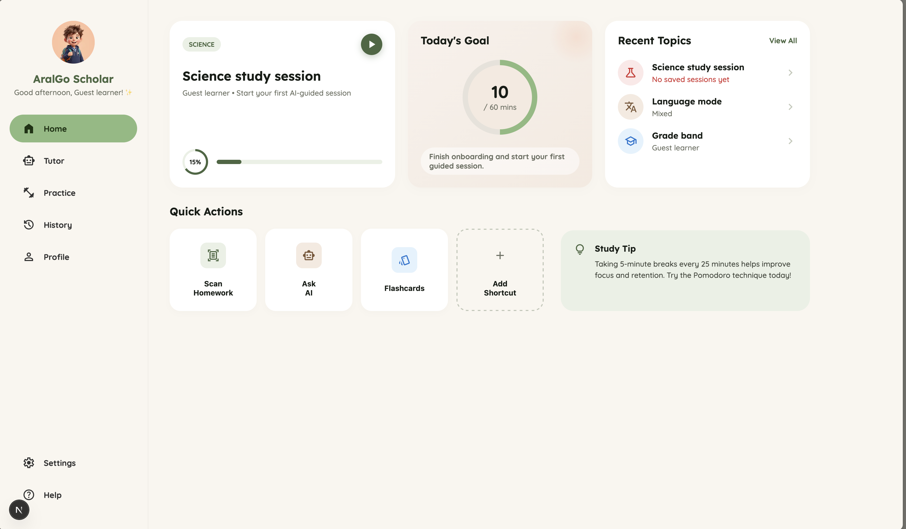

# AralGo

AralGo is a web-based AI study companion for Filipino learners, with Progressive Web App support planned for installability and resilient access. It is designed to provide bilingual academic support in Filipino, English, or mixed Filipino-English, with personalized tutoring, practice generation, and study flows that remain usable in low-bandwidth conditions.

The project currently has a Next.js app scaffold, Supabase client/server utilities, initial learner and study routes, planning documents, and the first Supabase migration for guest learning data.

## Product Goals

- Provide AI-powered tutoring for core academic subjects.
- Support Filipino, English, and mixed bilingual explanations.
- Adapt explanations and practice difficulty to learner level.
- Provide a responsive web experience with Progressive Web App capabilities.
- Keep core study flows usable in low-bandwidth conditions.
- Support guest-first study flows with a path toward durable Supabase-backed persistence.

## Tech Stack

- Next.js App Router
- React
- TypeScript
- Supabase Auth and Postgres
- CSS Modules
- ESLint

## Project Structure

```text
app/                    Next.js App Router pages, layouts, and route handlers
components/             Shared UI components
lib/                    Supabase helpers and study-domain logic
public/                 Static assets
supabase/               Supabase config and database migrations
docs/                   Product, architecture, task, and user-flow documents
.agents/                Project-local agent skills and workflow guidance
```

Important docs:

- `docs/PRD.md` describes the product requirements.
- `docs/architecture.md` describes the intended system architecture.
- `docs/USER_FLOW.md` maps the core learner journeys.
- `docs/TASKS.md` tracks implementation progress and open decisions.

## Getting Started

Install dependencies:

```bash
npm install
```

Run the local development server:

```bash
npm run dev
```

Open the app at:

```text
http://localhost:3000
```

## Available Scripts

```bash
npm run dev
```

Starts the Next.js development server.

```bash
npm run build
```

Creates a production build.

```bash
npm run start
```

Runs the production build locally.

```bash
npm run lint
```

Runs ESLint.

```bash
npm run typecheck
```

Runs TypeScript without emitting files.

## Environment

Create a local environment file before running Supabase-backed flows:

```bash
.env.local
```

Expected public values include:

```bash
NEXT_PUBLIC_SUPABASE_URL=
NEXT_PUBLIC_SUPABASE_ANON_KEY=
```

Keep server-only secrets out of client code and do not commit privileged Supabase keys.

## Supabase

The project uses Supabase for authentication and learner-owned study data. Database migrations live in `supabase/migrations/`.

For remote schema operations, use the linked Supabase project:

```bash
supabase db query "select now();" --linked --output json
```

The remote Supabase MCP server may return permission errors for schema operations, so the Supabase CLI is the preferred path for database changes in this repository.

## Current Status

Implemented:

- Next.js App Router scaffold
- Responsive app shell and dashboard routes
- Onboarding and learner setup screens
- Initial practice and tutor route surfaces
- Supabase SSR client, browser client, and proxy utilities
- Initial migration for learner profiles, study sessions, and tutor messages

Still in progress:

- Tutoring chat implementation
- AI provider and model decision
- Practice generation and answer feedback
- Persistent study history
- Low-bandwidth and offline caching behavior
- Test coverage

## Development Notes

- Use TypeScript for application code.
- Keep reusable product logic in `lib/`, not directly inside UI components.
- Use kebab-case for files, PascalCase for React components, and camelCase for variables and functions.
- Prefer lightweight, text-first UI decisions because the product targets broad web access and low-bandwidth learners.
- Review `.env.local` changes carefully before committing.
