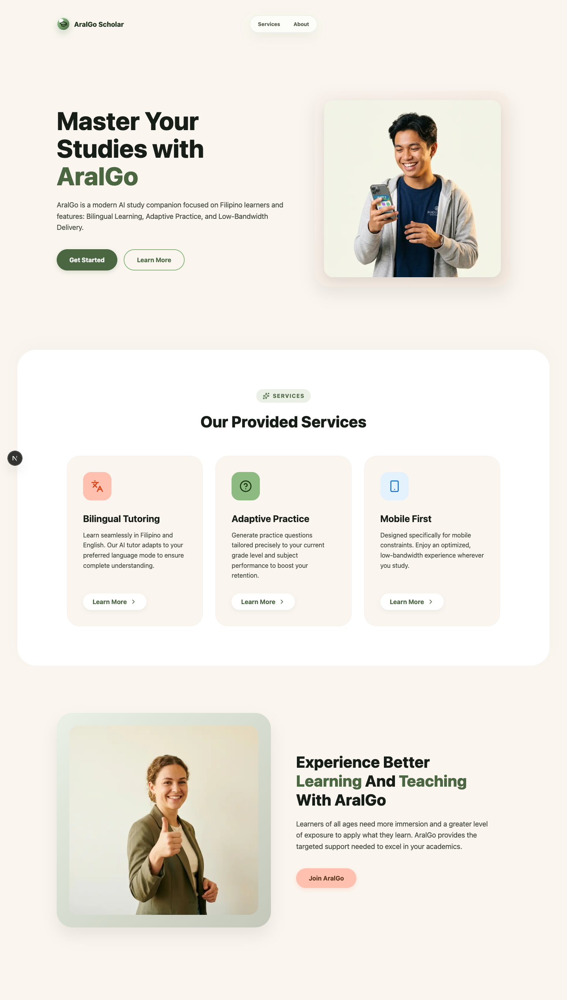
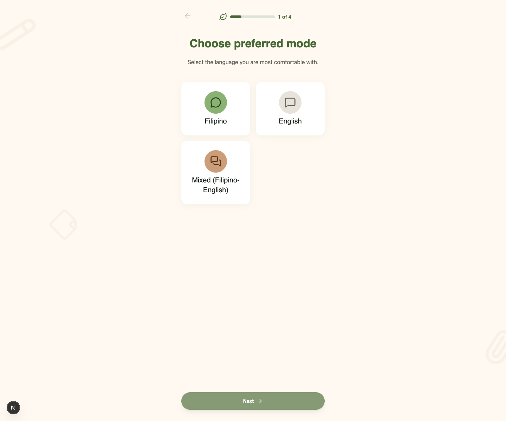
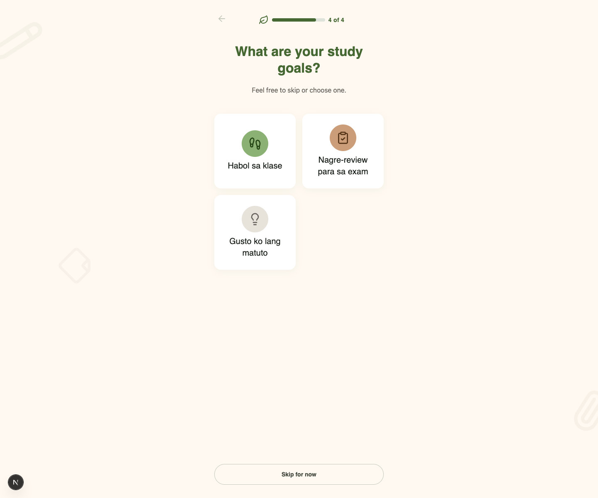
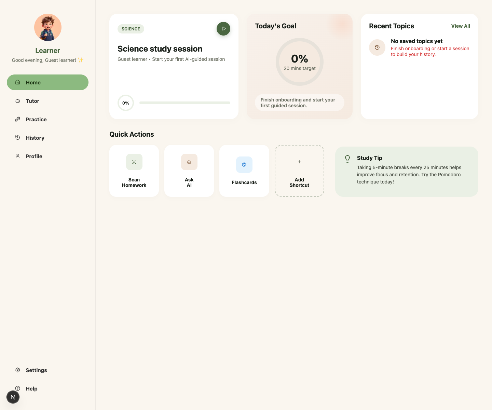
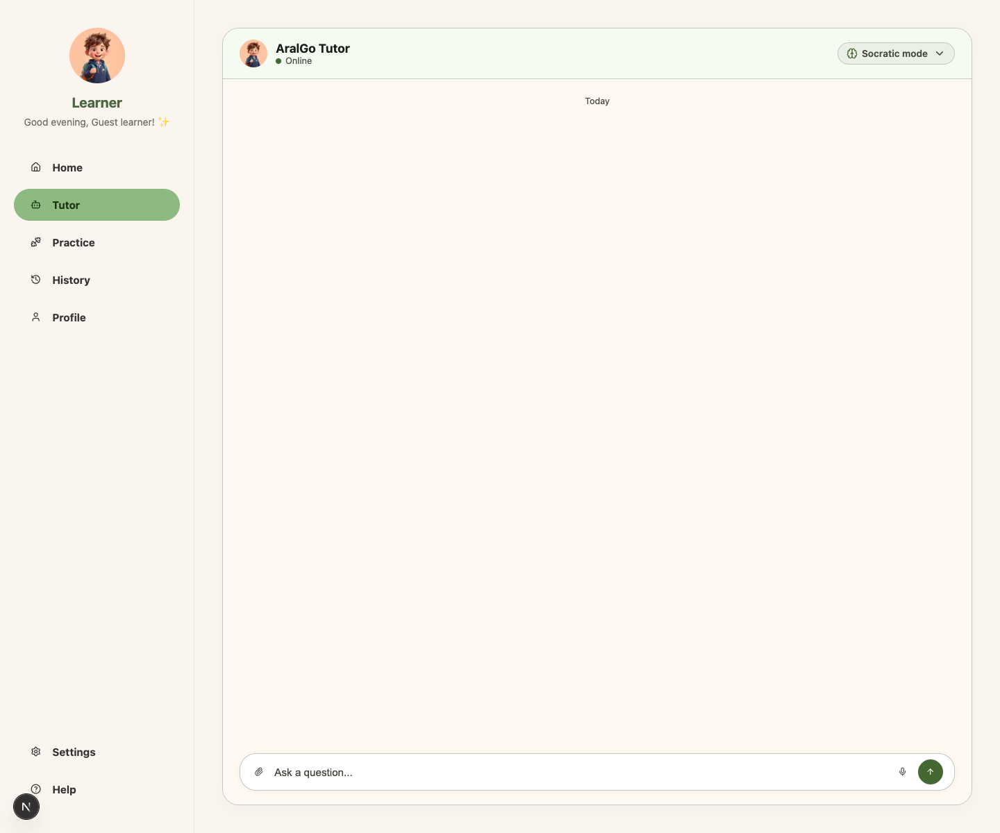
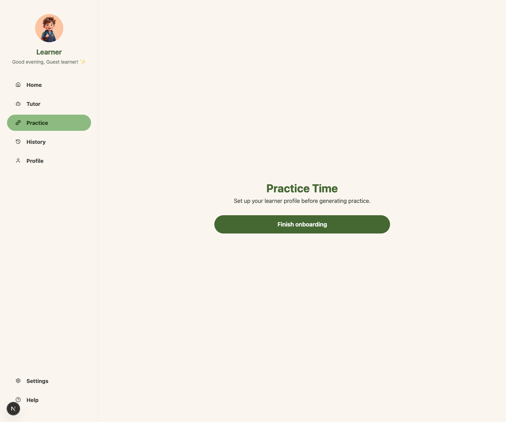

<div align="center">

# AralGo


</div>

> AI-powered study companion for Filipino learners with bilingual tutoring, mobile-first study flows, anonymous learner setup, and low-bandwidth Progressive Web App support.

---

## App Preview

### Landing


### Onboarding



### Dashboard


### Tutor


### Practice


---

## Problem

Many Filipino learners still face the same friction when studying outside the classroom:

- **Limited tutor access**: personalized academic help is often expensive or unavailable.
- **Language mismatch**: students may understand better in Filipino, English, or a natural mix of both.
- **Weak connectivity**: many learners rely on low-cost devices and unstable mobile data.
- **Generic study tools**: most apps do not adapt to grade level, topic, or learner pace.
- **Fragmented workflows**: tutoring, practice, and progress context are usually split across separate tools.

---

## Solution

AralGo brings tutoring, learner setup, and guided study flows into a single web app built for mobile use first. A learner can onboard quickly, choose a language mode and grade band, start a study session, and chat with an AI tutor that adapts its tone and explanation style to the learner context stored in Supabase.

The app is designed as a Progressive Web App so the shell loads quickly, recent learner context can survive weak connectivity, and the product remains usable on lower-end devices.

---

## Core Features

### Bilingual Learner Onboarding

- **4-step setup flow** for language mode, grade band, subjects, and study goal
- **Anonymous sign-in** via Supabase Auth for low-friction first use
- **Learner profile persistence** to Supabase plus local fallback state for resume flows

### AI Tutoring

- **Streaming tutor chat** powered by Azure OpenAI through the Vercel AI SDK
- **Two tutor modes**: Socratic mode and direct chat mode
- **Context-aware prompting** using subject, grade band, topic, and language preference
- **Language support** for Filipino, English, and mixed Filipino-English explanations

### Study Dashboard

- **Learner home view** with profile-aware study context
- **Recent-topic and goal surfaces** backed by Supabase data and local storage
- **Mobile-first shell** built with Next.js App Router and CSS Modules

### Practice and PWA Foundations

- **Practice setup UI** for subject, topic, difficulty, and format selection
- **Offline fallback page**, manifest, and service worker for installable PWA behavior
- **Supabase schema and RLS policies** for learner-owned study data

Note: tutoring is live, but practice generation/results are still mock-backed and tutor chat history is not persisted yet.

---

## App Flow

```text
1. Open AralGo on web or install it as a PWA
        ↓
2. Complete onboarding:
   language mode → grade band → subjects → study goal
        ↓
3. Anonymous learner session is created with Supabase Auth
        ↓
4. Learner profile and initial study setup are saved
        ↓
5. Enter the dashboard and continue to tutor or practice
        ↓
6. Tutor chat sends messages to /api/chat
        ↓
7. Server builds learner-aware prompts and streams Azure OpenAI responses
        ↓
8. Learner continues studying in Filipino, English, or mixed mode
```

---

## Project Structure

```text
app/                    Next.js App Router pages, layouts, and route handlers
components/             Shared UI building blocks
lib/ai/                 Tutor prompt construction and Azure OpenAI integration
lib/study/              Learner setup, dashboard shaping, and local study helpers
lib/supabase/           Browser/server/proxy Supabase clients
public/                 Static assets, PWA manifest, and service worker
supabase/               Supabase config and SQL migrations
docs/                   PRD, architecture, tasks, theme, and user-flow documents
e2e/                    Baseline smoke coverage
```

Important docs:

- `docs/PRD.md`
- `docs/architecture.md`
- `docs/USER_FLOW.md`
- `docs/TASKS.md`

---

## Current Status

- **Implemented**: Next.js scaffold, onboarding, dashboard shell, Supabase SSR wiring, anonymous auth, hosted schema migrations, PWA assets, live AI tutor streaming, and dashboard utility routes
- **Partial**: dashboard depth, offline/local caching breadth, practice flow, and smoke coverage depth
- **Missing**: persisted tutor transcripts, real AI-generated practice, and broader automated tests

---

## Local Setup

Prerequisites: Node.js 18+ and a Supabase project with anonymous sign-ins enabled. Tutoring also requires Azure OpenAI environment values.

```bash
npm install
```

Create `.env.local`:

```env
NEXT_PUBLIC_SUPABASE_URL=your_supabase_project_url
NEXT_PUBLIC_SUPABASE_PUBLISHABLE_KEY=your_supabase_publishable_key
AZURE_OPENAI_ENDPOINT=https://your-azure-openai-resource.openai.azure.com/
AZURE_OPENAI_API_KEY=your_azure_openai_api_key
AZURE_OPENAI_DEPLOYMENT=your_model_deployment_name
```

The tutor service still accepts the older `ENDPOINT`, `API_KEY`, and `DEPLOYMENT` names for backward compatibility, but new setups should use the Azure-prefixed variables above.

Run the app:

```bash
npm run dev
```

Open:

```text
http://localhost:3000
```

Available scripts:

```bash
npm run dev
npm run build
npm run start
npm run lint
npm run typecheck
```

---

## Supabase Notes

- Database migrations live in `supabase/migrations/`.
- For remote schema operations, prefer:

```bash
supabase db query "select now();" --linked --output json
```

- The remote Supabase MCP server can fail on schema operations; this repo uses the Supabase CLI as the reliable path for database changes.
