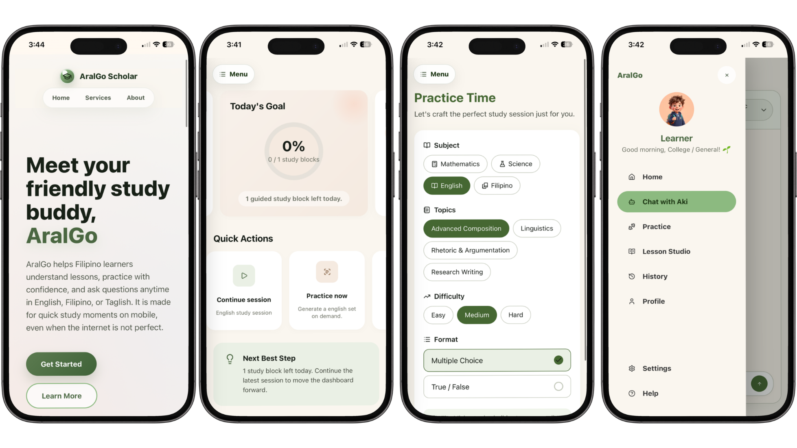

<div align="center">
  
  <h1>AralGo Scholar</h1>
  <p><strong>A mobile-first AI study companion for Filipino learners.</strong></p>
  <p>
    
    
    
    
    
    
    
    
  </p>
</div>

<p align="center">
  <a href="https://aral-go.vercel.app/"><strong>Try it here →</strong></a>
</p>

AralGo Scholar is a mobile-first AI study companion built for Filipino learners who need personalized academic support in the language, pace, and device conditions that actually match their daily lives.

It combines an adaptive Lesson Studio, an AI tutor with chat and Socratic modes, generated practice quizzes, session history, multilingual support across English, Filipino, and Taglish, and Progressive Web App foundations for low-bandwidth learning.


## Team

**larp final boss**

- Harley Albert C. Buendia — Team Representative/Developer
- Wayne Andrei C. Garcia — AI Developer
- Chloe Maxine A. Carbonell — UI Designer
- Josiah B. Abrogar — Developer

## Why AralGo Exists

Many Filipino students do not struggle because they lack effort. They struggle because the support system around them is uneven.

- Tutors can be expensive, unavailable, or concentrated in major cities.
- Connectivity can be slow, unstable, or limited by mobile data cost.
- Learning materials are often written for a generic learner, not for a specific grade level, subject, goal, or pace.
- Many tools assume English-first learning even when students understand faster in Filipino or natural Taglish.
- Students may need help at night, before exams, during commute time, or while reviewing on a low-cost phone.
- Practice tools often mark answers right or wrong without explaining the reasoning behind mistakes.

AralGo Scholar closes that gap by acting like an always-available study companion: it explains concepts, asks guiding questions, creates personalized lessons, generates practice sets, remembers sessions, and adjusts to the learner's context.

## How AralGo Scholar Helps

AralGo is designed around one core belief: educational support should feel personal even when the learner does not have access to a personal tutor.

Instead of forcing students through static lessons, AralGo starts from the learner's profile: grade band, subjects, preferred language, study goal, selected topics, and recent activity. AI services then use that context to shape explanations, tutoring style, lesson content, and practice questions.

For a student who needs direct help, AralGo can answer clearly in chat mode. For a student who needs deeper understanding, Socratic mode guides them with hints and questions instead of simply giving away the answer. For a student preparing for a quiz, Lesson Studio can turn a topic into a focused lesson and practice set. For a learner with unstable data, the PWA shell, local state, and offline route keep the experience lightweight and recoverable.

## Core Features

### Lesson Studio

Lesson Studio creates personalized study material from the learner's subject, grade band, topic selection, language mode, study goal, and learning preference.

- Generates structured lessons with overviews, key terms, worked examples, common mistakes, and recaps.
- Creates practice quizzes matched to selected topics and preferred question formats.
- Supports learning styles such as visual, step-by-step, practical, and reading-focused study.
- Accepts uploaded references such as images, PDFs, text files, Markdown, and CSV files for future lesson grounding workflows.
- Saves lesson drafts locally so learners can continue even after interruptions.
- Fetches subjects and grade-appropriate topics from Supabase-backed configuration.

### AI Tutor

The tutor gives students a safe place to ask questions, request explanations, and continue learning without fear of judgment.

- Chat mode provides direct, friendly answers for quick help.
- Socratic mode guides learners through reasoning with hints and questions.
- Responses adapt to grade band, subject, topic, and language preference.
- Tutor prompts are built server-side so AI behavior stays consistent and protected.
- Messages are persisted to Supabase and can be reloaded through session history.
- Response validation provides fallback messages when AI output is empty or unsuitable.

### Personalized Practice

AralGo turns studying into active recall instead of passive reading.

- Generates practice questions from selected subjects and topics.
- Supports multiple choice, short answer, and problem-solving formats.
- Includes correct answers, acceptable answers, explanations, and common mistake notes.
- Can be extended to generate easier, harder, or similar follow-up sets based on performance.
- Designed to eventually feed weak-topic signals back into the learner profile.

### Session History

Learning should not disappear when a tab closes.

- Stores study sessions by learner, subject, topic, language mode, status, and last activity.
- Saves tutor messages so learners can revisit previous explanations.
- Provides a dedicated history view for resuming past study sessions.
- Uses learner-owned Supabase rows protected by Row Level Security.
- Supports local state patterns for quick resume and offline-friendly dashboard behavior.

### English, Filipino, and Taglish Support

AralGo supports the way many Filipino learners actually think and communicate.

- English mode for school-aligned explanations and academic vocabulary.
- Filipino mode for conversational Tagalog explanations.
- Mixed mode for natural Taglish, useful when students understand concepts best through code-switching.
- Language preference is collected during onboarding and can shape tutor, lesson, and practice outputs.

### Mobile-First PWA

AralGo is built for the phone in a student's hand, not only for a laptop on a fast connection.

- Installable Progressive Web App foundation with manifest, app icon, and service worker.
- Offline fallback route for connection loss.
- Lightweight, text-first study flows that avoid dependence on heavy media.
- Local storage support for learner setup, lesson drafts, saved lessons, and dashboard continuity.
- Responsive Next.js App Router interface with mobile-first layouts.

## Main User Flows

### First-Time Learner

1. Learner opens AralGo on mobile.
2. Learner completes onboarding by choosing language mode, grade band, subjects, and study goal.
3. AralGo creates an anonymous Supabase-backed learner session.
4. Learner lands on the study home dashboard.
5. Learner starts a tutor session, opens Lesson Studio, or generates practice.

### Student Asking for Help

1. Learner selects a subject and topic.
2. Learner asks a question such as "Explain fractions" or "Ano ang photosynthesis?"
3. AralGo loads learner context and builds a tutor prompt.
4. The AI tutor responds in English, Filipino, or Taglish.
5. Learner follows up, switches mode, asks for an example, or requests practice.
6. The session and messages are saved for later review.

### Exam Review

1. Learner opens Lesson Studio.
2. Learner chooses a subject, grade-appropriate topics, learning style, and practice format.
3. AralGo generates a focused lesson with examples and common mistakes.
4. Learner generates a practice quiz from the same context.
5. Learner reviews explanations and returns to weak topics.

### Low-Bandwidth Study

1. Learner launches the installed PWA from a phone.
2. The app shell and core navigation load quickly.
3. If offline, the app shows the offline page instead of a blank failure state.
4. Locally saved setup, lesson drafts, and recent dashboard context remain available.
5. When connection returns, AI tutoring and Supabase-backed history continue.

### Returning Learner

1. Learner opens the dashboard.
2. Recent topics, profile context, and session history guide what to study next.
3. Learner resumes a past tutor session from history.
4. AralGo reloads prior messages and continues the conversation.

## Suggested Future Ideas

- Mastery map for each subject showing strong, improving, and needs-review topics.
- Smart review queue that resurfaces weak topics before exams.
- Parent or guardian summary view with privacy-conscious progress snapshots.
- Teacher-curated prompt packs for common classroom lessons.
- Offline read-only library of saved lessons and practice explanations.
- Image-based worksheet help with careful moderation and storage policies.
- Voice-friendly explanations or read-aloud formatting for accessibility.
- Deterministic grading for objective questions before AI-assisted review.

## Technology Stack

- Next.js App Router
- React
- TypeScript
- Supabase Auth, Postgres, and Row Level Security
- Supabase SSR helpers
- Vercel AI SDK
- Azure OpenAI-compatible AI services
- CSS Modules
- Progressive Web App manifest and service worker
- Playwright smoke testing

## AI Tools Used

AralGo Scholar was designed and implemented with help from:

- Codex
- Gemini
- OpenCode
- Microsoft Foundry

These tools support planning, coding, prompt design, AI service integration, validation, and product iteration.

## Project Structure

```text
app/                    Next.js App Router pages, layouts, and API routes
components/             Shared UI components and Lesson Studio components
lib/ai/                 AI clients, prompts, tutor, lesson, and practice services
lib/study/              Learner setup, dashboard data, Lesson Studio helpers
lib/supabase/           Browser, server, and proxy Supabase clients
lib/types/              Supabase and app domain types
public/                 PWA manifest, service worker, icons, and runtime assets
supabase/               Supabase configuration and database migrations
docs/                   Product, architecture, task, and user-flow documentation
e2e/                    Smoke tests
```

## Current Status

Implemented:

- Next.js application scaffold
- Mobile-first landing, onboarding, dashboard, tutor, practice, history, profile, settings, help, and offline routes
- Anonymous Supabase sessions
- Learner profile and study session persistence
- Tutor message persistence and history reload
- AI tutor streaming with chat and Socratic modes
- Lesson Studio wizard and AI lesson generation
- AI practice generation service
- Supabase schema for profiles, sessions, tutor messages, generated lessons, practice sets, questions, attempts, responses, topic performance, subjects, and topics
- PWA manifest, service worker, icon, and offline page
- Baseline smoke test script

In progress or planned:

- Richer performance-based adaptation
- Full practice attempt grading and progress analytics
- Broader local/offline caching for generated lessons and practice artifacts
- Stronger low-bandwidth retry and degraded-network states
- Expanded automated tests for AI validation, language behavior, practice flow, and history

## Local Development

Prerequisites:

- Node.js 18 or newer
- A Supabase project with anonymous sign-ins enabled
- Azure OpenAI or compatible deployment credentials

Install dependencies:

```bash
npm install
```

Create `.env.local`:

```env
NEXT_PUBLIC_SUPABASE_URL=your_supabase_project_url
NEXT_PUBLIC_SUPABASE_PUBLISHABLE_KEY=your_supabase_publishable_key
AZURE_OPENAI_ENDPOINT=https://your-azure-openai-resource.openai.azure.com/
AZURE_OPENAI_API_KEY=your_azure_openai_api_key
AZURE_OPENAI_DEPLOYMENT=your_model_deployment_name
```

Run the development server:

```bash
npm run dev
```

Open:

```text
http://localhost:3000
```

Available scripts:

```bash
npm run dev
npm run build
npm run start
npm run lint
npm run typecheck
npm run test:smoke
```

## Supabase Notes

Database migrations live in `supabase/migrations/`.

For remote schema operations, use the linked Supabase CLI path:

```bash
supabase db query "select now();" --linked --output json
```

The remote Supabase MCP server can return permission errors for schema operations, so this repository treats the Supabase CLI as the reliable path for database changes.

## Documentation

- `docs/PRD.md`
- `docs/architecture.md`
- `docs/USER_FLOW.md`
- `docs/TASKS.md`
