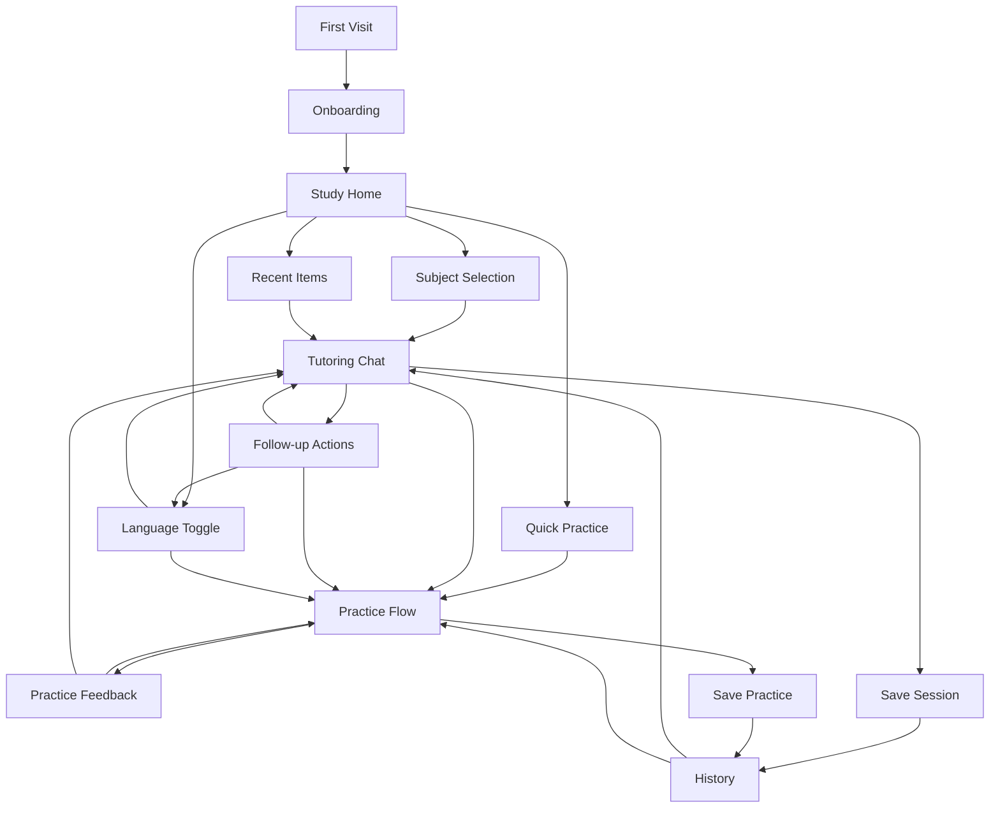

# AralGo User Flows

> End-to-end walkthroughs of every core journey in the app. Each flow covers entry, steps, decision branches, success states, and error/edge-case handling.

---

## 1. Onboarding & Profile Setup

**Entry:** First visit to AralGo — no local profile, no session.

```
[App Loads]
    |
    v
[Welcome Screen]
    |--- "Simulan" / "Get Started" -- tap -->
    |
    v
[Language Mode]
    Choose preferred mode:
      - Filipino
      - English
      - Mixed (Filipino-English)
    |
    v
[Grade Level]
    Select learning band:
      - Elementary (Grades 1–6)
      - Junior High (Grades 7–10)
      - Senior High (Grades 11–12)
      - College / General
    |
    v
[Subjects]
    Pick at least one subject:
      - Mathematics
      - Science
      - English
      - Filipino
    (+ "Maaaring magdagdag pa mamaya" / "Can add more later")
    |
    v
[Optional: Study Goals]
    Skip or choose:
      - "Habol sa klase" / "Catching up in class"
      - "Nagre-review para sa exam" / "Reviewing for exams"
      - "Gusto ko lang matuto" / "Just want to learn"
    |
    v
[Profile Saved Locally]
    Redirect to Study Home
```

**Edge cases:**
- Learner closes mid-onboarding → resume from where they left off (local state)
- All fields have defaults so any single tap moves forward
- No account required; profile lives in local storage + anonymous Supabase session

**Screen reference:** `(study)/page.tsx`, `components/onboarding/`

---

## 2. Study Home (Landing After Onboarding)

**Entry:** Profile exists, app opens to the main hub.

```
[Study Home]
    |
    +-- "Mag-aral ngayon" / "Study Now" ----+
    |    Quick-launch to last subject/topic  |
    |    or subject picker if first visit    |
    |
    +-- Subject Cards (Math, Science, etc.) -+
    |    Tap to enter subject hub            |
    |
    +-- Recent Items (last 3–5) ------------+
    |    Tap to resume                       |
    |
    +-- "Magsanay" / "Practice" ------------+
    |    Quick practice entry               |
    |
    +-- Language Toggle (top bar) ----------+
         Switch mode at any time
```

**Decision points:**
- New learner → subject picker → tutoring chat
- Returning learner → resume recent or pick new topic
- Practice mode → practice set flow

**Error states:**
- Empty state if no history yet: show prompt examples
- Network offline: show cached recent items, disable AI entry

---

## 3. Tutoring Chat Flow

**Entry:** Learner taps "Study Now", a subject card, or types a question.

```
[Subject & Topic Selection]
    |
    |--- If launched fresh: pick subject, type or select a topic
    |--- If resumed: existing session loads
    |
    v
[Chat Interface]
    |
    |--- Learner types a question (text input)
    |       |
    |       v
    |--- [Loading / "Tina-type ang sagot..." / "Typing answer..."]
    |       |
    |       v
    |--- AI response rendered with:
    |       - Explanation
    |       - Optional: example, recap, key terms
    |       - Suggested follow-up actions
    |           • "Ipaliwanag nang mas simple" / "Explain simply"
    |           • "Bigyan mo ako ng halimbawa" / "Give an example"
    |           • "I-step by step" / "Step by step"
    |           • "Ibaling sa Filipino/English" / "Switch language"
    |           • "Gumawa ng pagsasanay" / "Make a practice set"
    |
    v
[Learner Follows Up]
    |--- Ask a new question (continues session)
    |--- Tap a suggested action
    |--- Switch language mid-session
    |--- Request practice
    |--- End session → goes to session summary
```

**Acceptance criteria:**
- Follow-up actions are one-tap, not re-typing
- History scrolls; latest message auto-visible
- Streaming response if AI supports it (or full response on mobile)
- Session auto-saved after each exchange

**Error states:**
- Network failure mid-request → show retry button, preserve input
- AI returns empty/malformed → "Hindi ko nasagot nang maayos. Subukan muli?" / safe retry
- Empty question → disabled send button

**Screen reference:** `(study)/chat/page.tsx`

---

## 4. Practice Flow

**Entry:** Learner requests practice from chat or taps "Practice" on Study Home.

```
[Practice Entry]
    |
    +-- From Chat: "Gumawa ng pagsasanay" tap
    |       |
    |       v
    |   Select topic if not inferred from session
    |
    +-- From Study Home: "Magsanay"
            |
            v
        Pick subject → pick topic
    |
    v
[Difficulty Confirmation]
    Shows current level (e.g., Grade 7)
    |--- "Mas madali" / "Easier"
    |--- "Ganito lang" / "Keep as is"
    |--- "Mas mahirap" / "Harder"
    |
    v
[AI Generates Practice Set]
    Loading state → renders:
      - 3–5 questions
      - Mixed types: multiple choice, true/false, short answer
      - Progress indicator (Q1 of 5)
    |
    v
[Learner Answers]
    |--- Tap option (MC / T/F)
    |--- Type answer (short answer)
    |--- Submit
    |
    v
[Feedback Per Question]
    |--- Correct: "Tama!" / green indicator + brief reinforcement
    |--- Incorrect: gentle explanation + correct answer shown
    |--- "Ipaliwanag ang sagot" / "Explain this answer" tap
    |
    v
[End of Set]
    Summary:
      - Score (e.g., 4/5)
      - Topics to review
      - Suggested actions:
          • "Isa pang tulad nito" / "Another like this"
          • "Mas madali" / "Easier set"
          • "Mas mahirap" / "Harder set"
          • "Bumalik sa pag-aaral" / "Back to studying"
```

**Decision points:**
- Mid-set abandon → auto-save progress, show in history as incomplete
- Retry incorrect questions → generate similar ones
- Request harder/easier → regenerate with adjusted difficulty

**Error states:**
- Generation fails → retry button, fallback to cached practice if available
- Short answer ambiguous → "Hindi sigurado. Heto ang tamang sagot:" with explanation

**Screen reference:** `(study)/practice/page.tsx`

---

## 5. Language Mode Switching

**Entry:** Any screen with the language toggle (top bar or in-chat action).

```
[Language Toggle Tap]
    |
    v
[Quick Switcher]
    Shows current mode with checkmark:
      - Filipino
      - English
      - Mixed (Filipino-English)
    |
    v
[On Select]
    |--- During chat:
    |       "Gusto mo bang ipaliwanag ko ulit sa [new language]?"
    |       / "Would you like me to re-explain in [new language]?"
    |       |--- Yes → AI re-explains last message in new language
    |       |--- No → next messages use new language
    |
    |--- Outside chat:
    |       Preference saved immediately
    |       Next interaction uses new language
```

**Edge cases:**
- Switching mid-generation → new messages use new language, current response unaffected
- Mixed mode: AI receives instruction to blend naturally (not random code-switching)

**Screen reference:** Top bar component, chat action buttons

---

## 6. Study History & Resume

**Entry:** Study Home "Recent" section, or dedicated History route.

```
[History View]
    |
    Lists recent items grouped by type:
      - Tutoring sessions (topic, date, last message preview)
      - Practice sets (topic, score, date)
    |
    v
[Tap to Open]
    |--- Tutoring session:
    |       Loads chat view with previous messages
    |       Can continue asking
    |
    |--- Practice set:
    |       Shows summary (score, answers)
    |       Can retry or generate new similar set
    |
    v
[Cache Behavior]
    |--- Online: fetch fresh from Supabase
    |--- Offline: show local cache only
    |--- Stale cache: show cached, update silently when online
```

**Edge cases:**
- Session too long → show recent N messages + context summary, not full transcript
- Deleted/expired items → graceful "Hindi na available" / "No longer available"

**Screen reference:** `(study)/history/page.tsx`

---

## 7. Low-Bandwidth & Network Recovery

**Entry:** App detects slow, unstable, or absent network.

```
[Network Check]
    |
    +--- Online, fast ----> Normal flow (all features)
    |
    +--- Slow / unstable ---> [Degraded Mode Banner]
    |       "Mabagal ang koneksyon" / "Slow connection"
    |       Features:
    |         - Chat still works (payloads minimized)
    |         - Practice still works
    |         - Images/media suppressed
    |         - Retry timeout shortened
    |         - Optimistic UI with background retry
    |
    +--- Offline -------------> [Offline Mode]
            "Walang koneksyon" / "No connection"
            Available:
              - View cached recent history
              - View cached practice sets (read-only)
              - See profile / settings
            Unavailable (with message):
              - New chat questions
              - New practice generation
              - Session save (queued for later)
```

**Retry behavior:**
- Failed request → show retry button with message
- "Subukan muli" / "Try again" tap → re-sends last request
- Auto-retry once on timeout before showing error

---

## 8. Full User Journey Map



---

## Appendix: Screen & Route Map

| Route | Screen | Key flows |
|---|---|---|
| `/` | Landing / Marketing | First visit, onboarding entry |
| `/study` | Study Home | Subject cards, recent items, quick actions |
| `/study/chat` | Tutoring Chat | Question input, AI responses, follow-up actions |
| `/study/practice` | Practice | Set generation, question answering, feedback |
| `/study/history` | History | Session & practice list, resume |
| `/auth` | Auth (future) | Sign-in / sign-up for cross-device sync |

---

*Last updated: June 2026*
